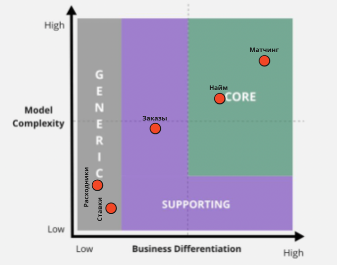

[Схемы в MIRO](https://miro.com/app/board/uXjVMG33R8E=/?share_link_id=50370757513)

## Поддомены

Я выделил следующие поддомены в системе:
* найм воркеров
* матчинг воркеров и клентов
* подбор расходников
* менеджмент и оплата заказов (интерфейсы клиента, воркера и менеджеров)
* мотивация менеджеров (ставки)

| Вид поддомена               | Конкурентное преимущество | Сложность | Изменчивость | Варианты реализации                  | Интерес проблемы | Предполагаемый вид поддомена |
|-----------------------------|---------------------------|-----------|--------------|--------------------------------------|------------------|------------------------------|
| Найм воркеров               | да                        | высокая   | высокая      | ?                                    | высокий          | core                         |
| Матчинг воркеров и клентов  | да                        | высокая   | высокая      | ?                                    | высокий          | core                         |
| Подбор расходников          | нет                       | низкая    | низкая       | Внешняя система склада/ свое решение | низкий           | generic                      |
| Менеджмент и оплата заказов | нет                       | высокая   | средняя      | Готовая CRM/ своё решение            | средний          | support                      |
| Мотивация менеджеров        | нет                       | низкая    | низкая       | ?                                    | низкий           | generic                      |

## Core domain chart 

В итоге из характеристик получился такой чарт:

## Боундед-контексты

Для всех поддоменов, кроме `Менеджмент и оплата заказов` - поддомен соответствует своему боундед-контексту.
`Менеджмент и оплата заказов` - решено разбить на `Менеджмент заказов` и `Биллинг заказов`. Связано это с тем,.
что работая в одном поддомене из-за высокой связанности по данным, эти контексты различаются "общим языком".

## Сравнение с первой итерацией

### Как оно было?

В первой итерации были выделены такие поддомены:

* найм воркера
* матчинг воркера на заказ
* аккаунтинг и биллинг (фактически центральный узел системы)
* комплектация расходников
* контроль качества
* ***интерфейс воркера***
* ***интерфейс менеджера***
* ***интерфейс клиента***

Как видим - были выделены лишние поддомены, при этом про боундед-контексты не было вообще ничего известно. 
А поддомены с одним название, зачастую выполняли не свои функции (например биллинг - считал ставки).

### Почему так вышло?

Скорее всего так получилось потому что поддомены искались не с точки зрения бизнес-процессов, 
а с точки зрения реализации и с вершины прошлого опыта. Поэтому также были места, где бизнес-команды 
разбились на технические шаги, в особенности в билинге и для нотификаций.

## Характеристики проекта

| Характеристика           | Требование                                                        | layered | modular-monolith | service-based | microservices |
|--------------------------|-------------------------------------------------------------------|---------|------------------|---------------|---------------|
| Availability             | "наши конкуренты могут попытаться нас заддосить в этом месте"     | ***     | ***              | **            | **            |
| Scalability и elasticity | Только для найма воркеров, в остальных местах нагрузка низкая     | *       | *                | ***           | ****          |
| Modifiability            | "Для бизнеса критично проверять новые гипотезы..."                | *       | **               | ***           | ****          |
| Maintainability          | "наши конкуренты могут попытаться нас заддосить в этом месте"     | **      | ***              | **            | ****          |
| Securability (security)  | Из-за необходимости разделения областей видимости                 | **      | **               | ***           | ****          |
| Performance              | Явных требований нет                                              | ***     | ***              | ***           | **            |
| Agility                  | Могут меняться алгоритмы матчинга, расчета цены, подбора воркеров | *       | **               | ***           | ****          |
| Testability              | "Для бизнеса критично проверять...с максимальной надёжностью"     | *       | **               | ***           | ****          |
| Deployability            | "Для бизнеса критично проверять...с максимальной скоростью"       | *       | **               | ****          | ****          |
| Usability                | Наличие разделов для пользователей                                | ***     | ***              | ***           | ***           |
| Consistency              | Наличие финансовой информации                                     | ****    | ***              | ***           | **            |
| Simplicity               | Наличие нескольких поддоменов                                     | ****    | ***              | **            | *             |
| Evolvability             | Необходимость быстро проверять новые теории                       | *       | **               | ****          | ****          |
| Fault-tolerance          | "наши конкуренты могут попытаться нас заддосить в этом месте"     | *       | **               | ***           | ****          |

Есди основываться на требуемых характеристиках, наличию крайне изолированных поддоменов с минимальной связью по данным
и отсутствию жёсткой экономии - наиболее оптимальными выглядят `service-based` и `microservices` подходы.
Но так как важнее ТТМ, то возьмём `service-based` архитектуру. 
При этом между боундед-контекстами не требуется наличия синхронных взаимодействий, так как бизнесс-процессы в них,
в общем случае могут идти параллельно. Однако внутри контекста `Менеджмент и оплата заказов` - все связи должны быть
синхронными для сохранения консистентности данных заказа и оплат.
Что касается реализации микросервисов, то стоит оценить использование внешних CRM (с возможностью модификации под сои нужды) 
и программ складского учета для поддоменов `Менеджмент и оплата заказов` и `Подбор расходников`
