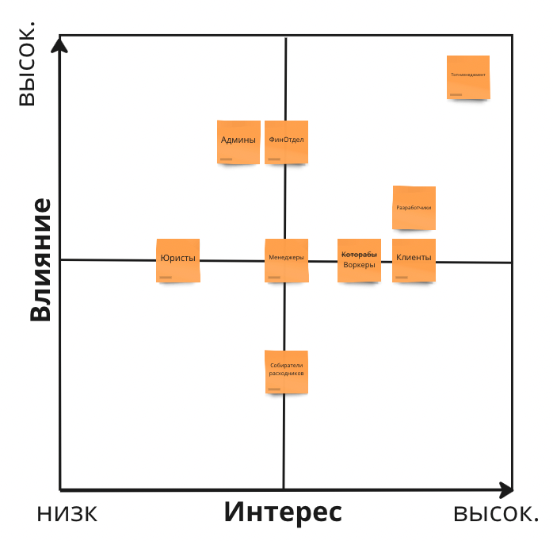

[Схемы в MIRO](https://miro.com/app/board/uXjVMG33R8E=/?share_link_id=50370757513)

## Стейкхолдеры

### Матрица стейкхолдеров

### Требования

| Стейкхолдер            | Консёрн                                                                                                                                                                                                                       |
|------------------------|-------------------------------------------------------------------------------------------------------------------------------------------------------------------------------------------------------------------------------|
| Топ-менеджмент         | Хочет продавать подбор которабов другим компаниям и тестировать больше гипотез   релизный цикл для всей системы — котл-месяц, для подбора — неделя максимум.                                                               |
| Менеджеры              | Хотят, спрятать систему ставок от разработчиков, которые не будут ей заниматься, и от начальства, и от других отделов;                                                                                                        |
| Финотдел               | Хотят списывать деньги раз в месяц, но платить которабам раз в неделю. Постоянно добавлять новые способы сдирания денег с клиентов. Которабам положена только «Золотая шляпа» Боятся потерять любую финансовую информацию. |
| Разработчики           | Система должна работать без сбоев, а если сбой случается, то должно быть понятно, что и где чинить.                                                                                                                           |
| Админы                 | Простота мониторинга системы для своевременного замечания сбоев, чтобы не работать в подвальном режиме.                                                                                                                       |
| Юристы                 | Чтобы маски-шоу было только по ТВ                                                                                                                                                                                             |
| Клиенты                | Работает без сбоев и тупняков                                                                                                                                                                                                 |
| Которабы               | Хотят еды и чтобы всё работало без сбоев                                                                                                                                                                                      |
| Собиратели расходников | Хотят автоматизации                                                                                                                                                                                                           |

### Общие новые требования по системе

Выяснилось, что котам из Happy Cat Box наш проект понравился, поэтому приходит не 10 заказов в день, а 10 заказов в минуту.

## Архитектурный стиль

В прошлой домашке был выбран `microservices` стиль архитектуры с асинхронными связями. 
Выбор был сделан на основе того, что проект требует низкий `TTM`, т.е. высокие значения `Agility`, `Deployability` и `Testability`.
А ыделенные сервисы - максимально независимы по данным и могут работать асинхронно. 
При этом сервисы имеют разные требуемые характеристики. Дополнительно у нас появились характеристики `Maintainability` и `Simplicity`
из-за требований азработчиков и админов. Также в связи с ростом нагрузки - нам потребуется лучший `Scalability` для системы в целом.
Исходя из сказанного и таблицы сравнения сервисов и урока, а также того, 
что в системе крайне мало шаренных событий и они просты - выбор падает на `event-driven` тип архитектуры

## Сервисы

После изучения требований к системе, пары косяков и стакана абсента появилась схема сервисов с [требованиями](https://miro.com/app/board/uXjVMG33R8E=/?moveToWidget=3458764555756691164&cot=14)
Ниже выделенные сервисы и причины выделения

| Сервис                     | Причина                                                                                                                     |
|----------------------------|-----------------------------------------------------------------------------------------------------------------------------|
| Найм воркеров              | Уникальность, частые изменения, защита от DDOS                                                                              |
| Матчинг воркеров и клентов | Уникальность, внешние разработчики, частые изменения, свой язык внутри                                                      |
| Подбор расходников         | Независимость от других сервисов, необходимость связи с внешним миром, возможность внешнего решения                         |
| Менеджмент заказов         | Высокая сложность, кото-френдли, требования по росту                                                                        |
| Оплата заказов             | Консистентность данных, требования по частым добавлениям новых интеграций, требования к стабильности и соответствия законам |
| Выплата пайка которабам    | Консистентность данных, требования к стабильности и соответствия законам                                                    |
| Мотивация менеджеров       | Сильно сайд-задача, очень скрытная, потенциально опасна проблемами с законом                                                |

### Архитектура сервисов

| Сервис                     | Архитектура    | Обоснование                                                                              |
|----------------------------|----------------|------------------------------------------------------------------------------------------|
| Найм воркеров              | Microservices  | Нужна защита от DDOS, частые обновления, возможность кратного роста                      |
| Матчинг воркеров и клентов | Pipeline       | По описанию подходит да и уж очень хочется пощупать разрабьотчикам, техногики)           |
| Подбор расходников         | Layered        | Чем дешевле - тем лучше                                                                  |
| Менеджмент заказов         | Service-Based  | Нам нужен хороший Performance с достаточным Scalability и высоким Maintainability        |
| Оплата заказов             | Miсrokernel    | Maintainability, Testability при наличии частого добавления новых элементов в систему    |
| Выплата пайка которабам    | Layered        | Дешево/сердито/надёжно да и редко меняется. И если сломается - рабы пострадают и отойдут |
| Мотивация менеджеров       | Layered        | Чтобы даже менеджер смог сам написать!                                                   |

## Виды баз данных

| Сервис                     | БД       | Обоснование                                                                                 |
|----------------------------|----------|---------------------------------------------------------------------------------------------|
| Найм воркеров              | Document | Частые изменения, явно нечеткие данные и т.д.                                               |
| Матчинг воркеров и клентов | Graph    | Модно, молодежно, и даже похоже на правду, для map-reduce. А вообще мало даных об алгоритме |
| Подбор расходников         | RDBMS    | Склад дело тонкое - хорошо бы иметь консистентность                                         |
| Менеджмент заказов         | RDBMS    | Требуется консистентность данных - не стоит терять данные клиентов                          |
| Оплата заказов             | RDBMS    | Требуется консистентность данных, возможны внешние ограничения со стороны законов           |
| Выплата пайка которабам    | RDBMS    | Требуется консистентность данных, возможны внешние ограничения со стороны законов           |
| Мотивация менеджеров       | RDBMS    | Требуется консистентность данных, но как никак, а крутим рулетку то с хранением в ОЗУ)      |

## Стиль коммуникаций

Комуникации между сервисами - асинхронные в хореографическом варианте, просто душа требует танцевать.
Выбрат по причине того, что сервисы не блокируют работу друг-друга, время реакции сервисов не известно и не особо важно. 
Что позволяет нам выполнять ивенты параллельно, попивая ракию и танцуя. 
Таким образом мы увеличиваем возможности системы по `Scalability` отдельных частей независимо от других.

## Фитнес-функции

После 12 часового рабочего дня, расплавленный мозг отказался искать фитнес-функции для всех требований.
Поэтому запишем так: пока архитектор не отдохнёт соответствие системы заявленным характеристикам будет
проверяться органолептически и чем вкуснее накормлен проверяющий коммандой, тем выше оценка сервиса.
А уж после отпуска, придётся вспомнить уроки МатАна и описать проверки поедая огурец)
