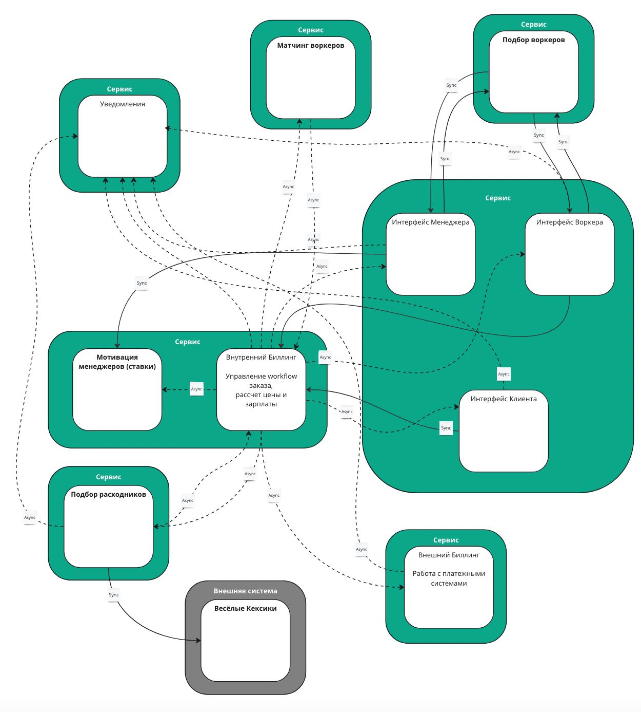

### Струтура системы после 0й домашки

### Instability сервисов

| Сервис                                | Ca  | Ce  | Instability |
|---------------------------------------|-----|-----|-------------|
| Матчинг воркеров                      | 1   | 1   | 0.5         |
| Найм воркеров                         | 2   | 2   | 0.5         |
| Интерфейсы пользователей              | 5   | 7   | 0.54        |
| Уведомления                           | 6   | 0   | 0           |
| Биллинг и управление workflow заказов | 5   | 7   | 0.54        |
| Подбор расходников                    | 1   | 3   | 0.75        |
| Биллинг оплат                         | 1   | 1   | 0.5         |
| Пекарня кексиков                      | 0   | 1   | 1           |

### Структура предлагаемых изменений

Что не так с системой? 
* Отдельный сервис нотификаций
* Найм воркеров провязан данными и вызовами с интерфейсами
* Интерфейсы живут отдельно от сервисов данных
* Ставки в одном сервисе с менеджментом заказов
* Биллинг воркеров и клиентов в одном месте с менеджментом заказов
* Работа с платежками вынесена в отдельный сервис

Что предлагается поменять:
* Разобрать сервис нотификаций
* Разделить на сервисы нынешний сервис менеджмента заказов, на отдельные биллинги, ставки и собственно заказы
* Разобрать отдельный сервис интерфейсов - перенеся интерфейсы в соответствующие сервисы

### План работ с учетом отсутствия опыта

1. Выносим самое простое - Gambling, при этом убирая его интерфейсы из сервиса интерфейсов. Выносим написанием нового сервиса, без сохранения данных
2. Продолжаем тренироваться, делаем сервис матчинга воркеров, применяя нужный тип БД, для этого сначала сервис, потом наливаем данные. Сюда же переносим нужные части интерфейса
3. Обновляем сервис найма воркеров переделкой БД (была реляционная) и добавлением нужных интерфейсов
4. Пишем новый сервис - Биллинг клиентов, с нужной архитектурой и с нужными платежками и интерфейсами
5. Переносим данные и переключаем биллинг клиентов на новый сервис
6. Пишем новый сервис - Биллинг воркеров, с нужной архитекутрой, с нужными интерфейсами и интеграцией со Шляпой(с)
7. Переносим данные и переключаем биллинг воркеров на новый сервис
8. В этот момент у нас остались разнесенные менеджмент заказов и его интерфейсы, а также уведомления. Поэтому собираем их вместе, благо БД у них общая и данные можно не переносить

Основной метод разделения и вынесения - Strangler Fig Application, потому что практически все сервисы надо переделывать,
и менять архитектуру и языки под команду разработчиков

